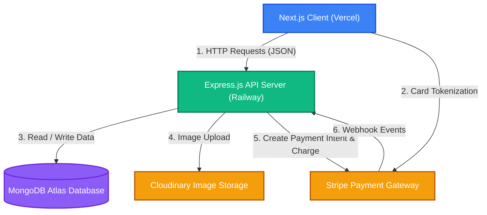
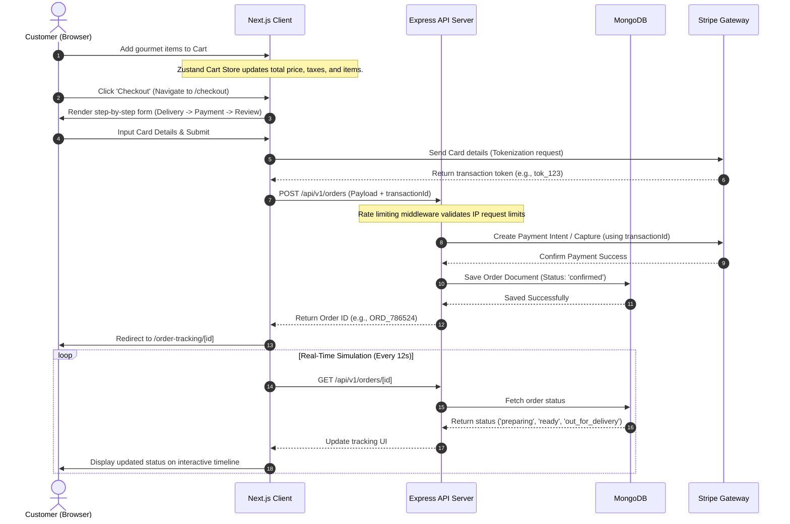
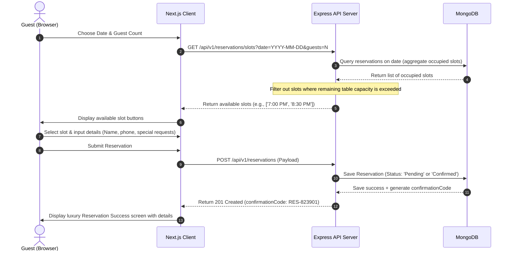
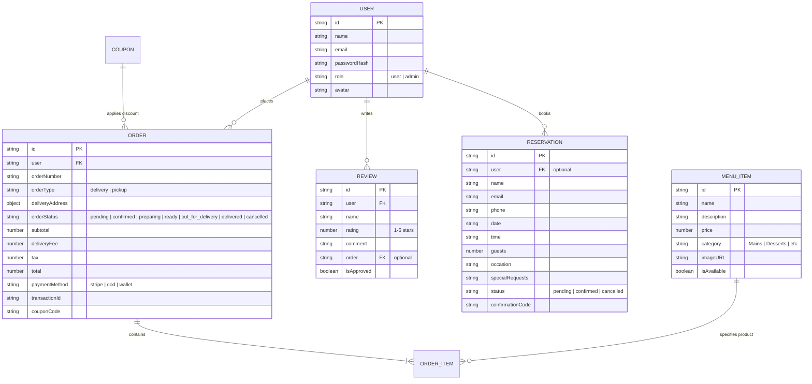
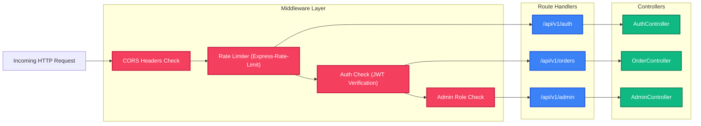
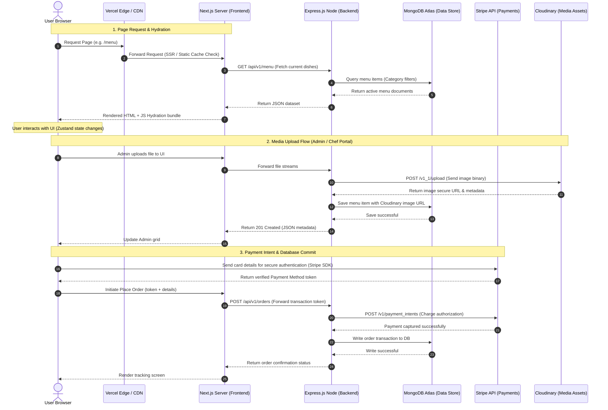

# Lumiere Restaurant — System Architecture Flow Diagrams

This document contains visual flowcharts mapping the system components, data schemas, order checkouts, table bookings, and server middleware for the Lumiere application.

---

## 1. High-Level System Architecture

Illustrates the client-side UI nodes communicating with Express controllers, Stripe APIs, Cloudinary assets, and the MongoDB cluster.

---

## 2. Core User Flows

### A. Ordering & Payment Flow
Sequence tracing adding items to cart, securing validation token cards via Stripe API, backend placement verification, and real-time status timeline updates.

---

### B. Table Reservation Flow
Checking occupied seat counts dynamically when selecting reservation schedules to prevent double-booking.

---

## 3. Database Schema Flow (Relationships)

How database models are referenced relational-style in MongoDB using Mongoose ObjectIds.

---

## 4. API Endpoints Map & Middleware Flow

Layered request filter processing pipeline inside Express routing layers.

---

## 5. Live Runtime & System Data Flow

Tracing render hydration, media ingestion stream routing, and payment authorizations during live production environments.

